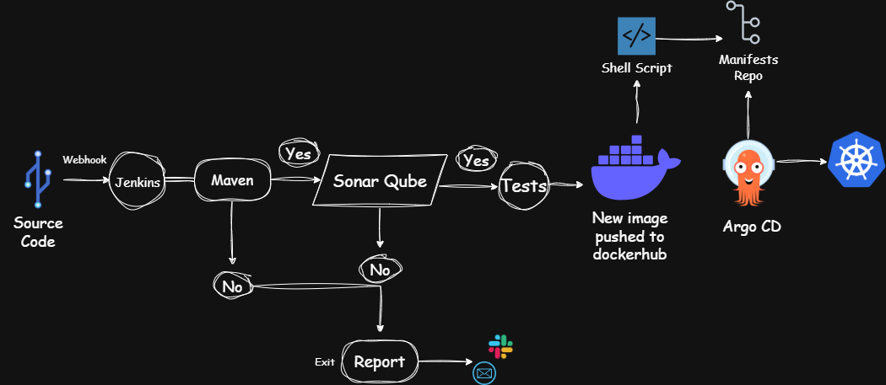

# DevOps CI/CD Pipeline – Java Application with Jenkins, SonarQube, Docker, ArgoCD, and Kubernetes

This project demonstrates a full CI/CD pipeline for a Java web application using industry-standard DevOps tools and a GitOps deployment approach. The pipeline includes continuous integration with Jenkins, code quality analysis with SonarQube, containerization with Docker, image publishing to Docker Hub, and deployment to a Kubernetes cluster using ArgoCD.

---

## Table of Contents

- [Project Overview](#project-overview)
- [Tech Stack](#tech-stack)
- [Architecture Diagram](#architecture-diagram)
- [CI/CD Pipeline Stages](#cicd-pipeline-stages)
- [Setup Instructions](#setup-instructions)
- [Folder Structure](#folder-structure)
- [Future Improvements](#future-improvements)

---

## Project Overview

The goal of this project is to implement an end-to-end DevOps pipeline with:

- **Automated builds, testing, and code analysis**
- **Dockerized packaging and registry storage**
- **Kubernetes deployment through GitOps using ArgoCD**
- **Modular and extensible structure aligned with real-world practices**

---

## Tech Stack

| Function            | Tool/Technology               |
|---------------------|-------------------------------|
| Version Control     | GitHub                        |
| CI/CD Orchestration | Jenkins (Docker Agent)        |
| Static Code Analysis| SonarQube                     |
| Containerization    | Docker                        |
| Image Registry      | Docker Hub                    |
| Deployment          | ArgoCD                        |
| Orchestration       | Kubernetes (Minikube/EKS)     |
| Application Stack   | Java, Maven                   |

---

## Architecture Diagram



---

## CI/CD Pipeline Stages

1. **Code Commit**  
   Developers push code to the GitHub repository.

2. **Webhook Trigger**  
   GitHub webhook notifies Jenkins of the new commit.

3. **Jenkins CI**
   - Pull latest code
   - Compile and build using Maven
   - Run unit tests
   - Perform static code analysis via SonarQube
   - Build Docker image
   - Push image to Docker Hub

4. **GitOps Update**
   - Jenkins updates the Kubernetes manifest (image tag) in a GitOps repository

5. **ArgoCD CD**
   - ArgoCD syncs changes from the GitOps repo
   - Automatically deploys the new version to Kubernetes

---

## Setup Instructions

### Prerequisites

- Docker and Docker Compose
- Jenkins running in Docker (with Docker-in-Docker enabled)
- SonarQube running locally or in Docker
- Kubernetes cluster (Minikube, Kind, or managed)
- ArgoCD installed and connected to GitOps repo
- Docker Hub account
- GitHub repository

### Clone the Repository

```bash
git clone https://github.com/mustafadhari/java-spring-boot.git
cd devops-java-cicd-pipeline
````

### Configure Jenkins

* Create a Jenkins pipeline project
* Use the included `Jenkinsfile`
* Add credentials and environment variables:

  * `DOCKER_HUB_USERNAME`
  * `DOCKER_HUB_PASSWORD`
  * `SONARQUBE_TOKEN` (if using authentication)
  * GitHub credentials (for SCM and GitOps repo)

### Run SonarQube

```bash
docker-compose -f sonarqube/docker-compose.yml up -d
```

> Ensure `sonar-scanner` is available inside Jenkins agent or use a container with it preinstalled.

### Docker Image Build & Push

Handled automatically by Jenkins pipeline:

```bash
docker build -t yourusername/java-app:latest .
docker push yourusername/java-app:latest
```

### Kubernetes & ArgoCD Setup

* Ensure your Kubernetes cluster is running
* Install ArgoCD ([https://argo-cd.readthedocs.io](https://argo-cd.readthedocs.io))
* Point ArgoCD to your GitOps repo containing updated manifests
* ArgoCD will detect changes and deploy automatically

---

## Folder Structure

```
devops-java-cicd-pipeline/
├── Jenkinsfile
├── Dockerfile
├── k8s-manifests/
│   ├── deployment.yaml
│   ├── service.yaml
├── sonarqube/
│   └── docker-compose.yml
├── src/
│   └── main/
│       └── java/...
├── pom.xml
├── README.md
└── docs/
    └── architecture.png
```

---

## Future Improvements

* Add integration tests post-build
* Integrate Slack/MS Teams notifications via Jenkins
* Implement secrets management via HashiCorp Vault or Sealed Secrets
* Use Helm charts for Kubernetes packaging
* Introduce environment-specific pipelines (dev/staging/prod)

---

## License

This project is provided for learning and demonstration purposes.
